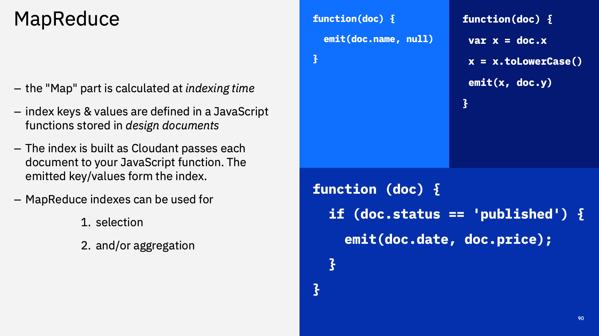
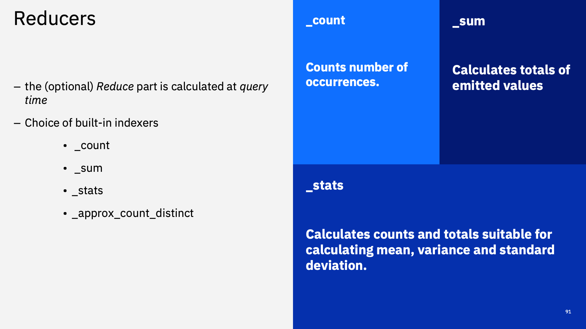
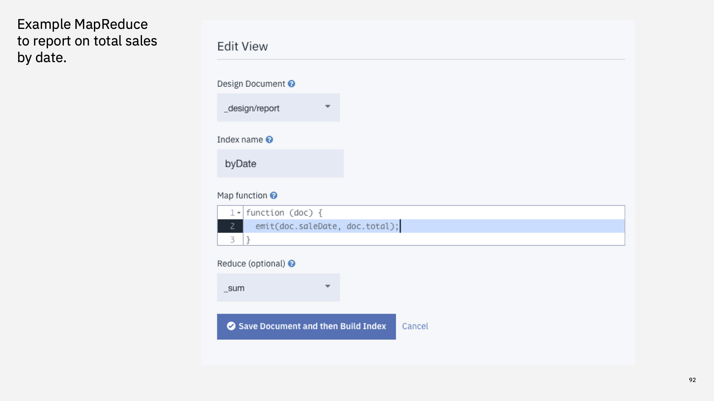
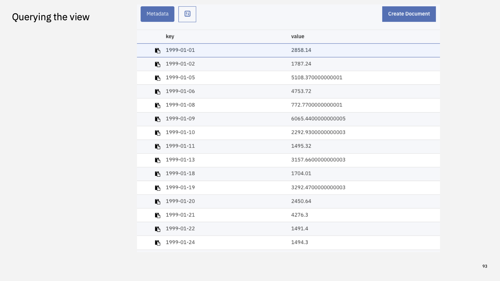
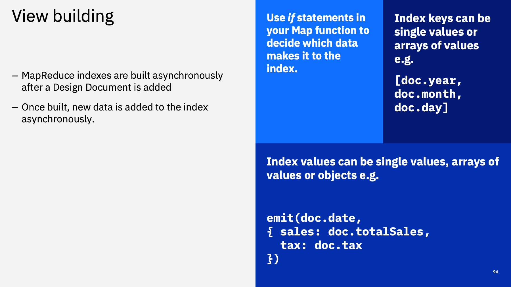
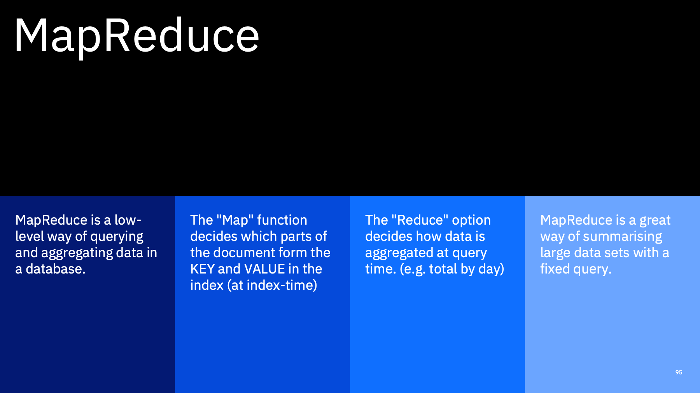

---

This is part 12: "MapReduce".

We've seen how a combination of the `_find` and `_index` endpoints allows queries to be performed on the contents of JSON documents, backed by secondary indexes to make queries scale as your application grows.

In this part, we'll introduce another way of configuring secondary indexes called MapReduce.


---

MapReduce used to be the _only_ way to configure secondary indexes in CouchDB and is still a popular way of querying data from within the document body.

To create a MapReduce index, you need to supply a JavaScript function wrapped in a special document called a _design document_ to Cloudant. Design documents' `_id` fields begin with `_design/` e.g `_design/mydesigndoc`. 

When Cloudant receives the design document it will set up a background indexing task, passing each document from the database to your JavaScript function in turn: the key/values that are _emitted_ by your JavaScript function form the basis of the index that is persisted.

Let's look at some example JavaScript functions on the right of the screen. 

The function accepts one parameter - the document that is passed to it by the Cloudant indexer. Every time your function calls `emit` the parameters you pass form the key/value of the index. 

```js
function(doc) {
  emit(doc.name, null)
}
```

The first example emits a key of `doc.name`, so this is an index for lookups by the name field and there is nothing (null) for the value.

```js
function(doc) {
 var x = doc.x
 x = x.toLowerCase()
 emit(x, doc.y)
}
```

The second example pre-processes the data prior to emitting. This is a useful way of tidying up strings, trimming whitespace, lower/uppercasing text, applying default values to missing data, or constraining values to certain ranges etc.

```js
function (doc) { 
  if (doc.status == 'published') {
    emit(doc.date, doc.price);
  }
}
```

The third example adds logic: only documents that are "published" make it to the index. This is equivalent to the _partial filter_ selector we saw with Cloudant Query.

Indexes build asynchronously and cannot be used until they have built completely. Once built, they can be used for selection by key, lists of keys, ranges of keys and can also be used for _aggregation_ of data e.g. "find orders between two dates, and calculate the total value of the orders, grouped by month."



---

There are four built-in reducers (or five if you count "none").

- `_count` - for counting things.
- `_sum` - for totalising values.
- `_stats` - for providing counts and totals suitable for calculating means, variances and standard deviations.
- `_approx_count_distinct` - for approximate counting of unique values of the key.



---

The design document's MAP function is passed a "doc" - the function is called once per document in the database. Any key/value pairs "emit"ed from the MAP function create the index.

The KEY is the thing (or things) you want to "select" on (e.g. date).

The VALUE is the thing you need to report on (e.g. total sales).

The Reducer is _sum, so that the VALUE  is totalled for matching keys (e.g orders on the same date).

Here's what defining a MapReduce looks like in the Cloudant dashboard.



---

When the MapReduce view is built, it can be queried to see each KEY/VALUE pair stored in the index.

Or, if the reducer is switched on result set can be grouped by the value of each key. Here we are totalising each day's sales.

The view can be queried for individual keys (e.g. sales on a given date), all keys, or a range of keys (e.g. between two dates).



---


MapReduce views are built asynchronously and may take some time to be ready for large data sets.

Here's some tips:

- use `if` logic in your JavaScript to only include data that makes sense. e.g. only totalise completed orders.
- indexed keys don't have to be strings. A common pattern is to use array keys e.g an array of year, month, day. This allows query-time grouping by elements in the array e.g. orders by year, orders by year & month, orders by year & month & day - great for summary reports that allow the user to drill down into the detail.
- the value can by a string, number or sometimes a small object containing a sub-set of the document. The object can be used instead of adding `include_docs=true` which would also return the document's body in the result set.



---

To summarise:

MapReduce is a low-level means of defining indexes that allow the selection and aggregation of data. 

Use JavaScript logic to decide which data makes it to the index. Choose how the index is formed by emitting keys/values.

Summarise data with the built-in reducers.
Produce concise reports from lots of data very efficiently.

MapReduce is great for boilerplate queries that your application needs to do again and again. Not for one-off, adhoc-queries for data exploration.



---

That's the end of this part. The next part is called ["Dates"](./Part&#32;13&#32;-&#32;Dates.md)
 


---