---

This is part 18: "Under the hood". 

Let's take a look at how a Cloudant service is organised: this overview applies to the Cloudant services that map to CouchDB 2 & 3. CouchDB 4 will be built on different technology.

---

Cloudant is a distributed database with data stored around a cluster of storage nodes. Picture the Cloudant service as ring of nodes, in this case twelve. Every node can deal with incoming API calls and every node has responsiblity for storing some of the data: shards and associated secondary indexes of databases that exist in the cluster.

When data is written to Cloudant one of the nodes in the ring will handle the request: it's job is to instruct three copies of the data to be stored in three storage nodes. Data is stored in triplicate in Cloudant, so each shard of a database is stored multiple times, often across a region's availability zones.

When you make an API call to write data and get a response back, we have written the data to at least 2 of the 3 storage nodes. Data is flushed to disk - it isn't cached in memory to be flushed data. We consider that technique too risky and prone to data loss.

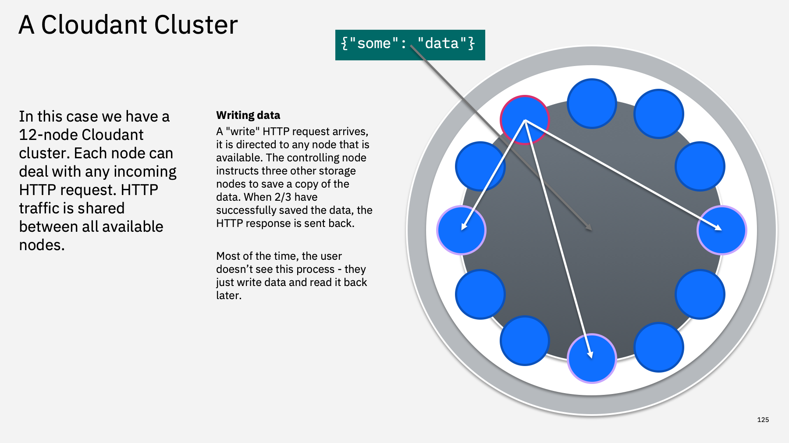

---

When you create a database, a number of database _shards_ are created (16 by default) which are spread around the cluster. As there are 3 copies of each shard, that's 48 shard copies.

You don't see any of this - it's handled for you transparently when you create a database.

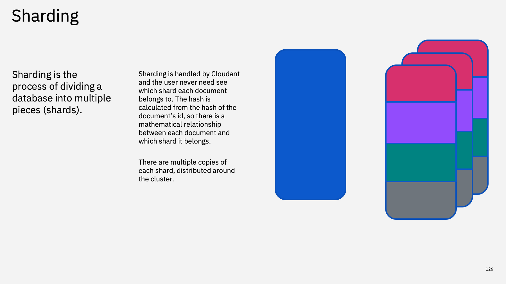

---

What happens if a node goes down or needs to be rebooted for maintenance? The rest of the cluster continues as normal. Most shards still have three copies of data but some will only have two. API calls will continue to work as normal, only two copies of the data will be written.

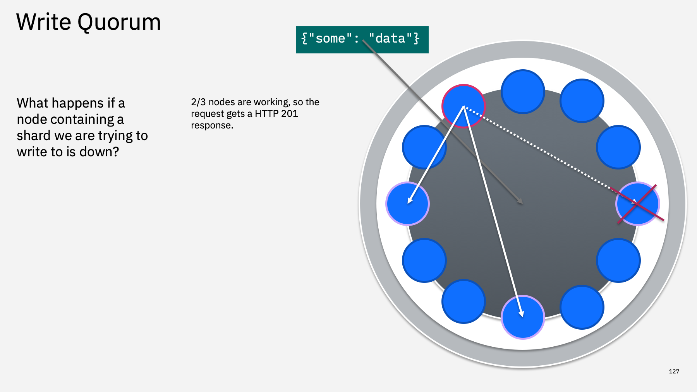

---

Even if two nodes go down, most shards will still have three copies, some will have two and some will have one. Writes will continue to work, although the HTTP response code will reflect that the _quorum_ of 2 node confirmations wasn't reached.

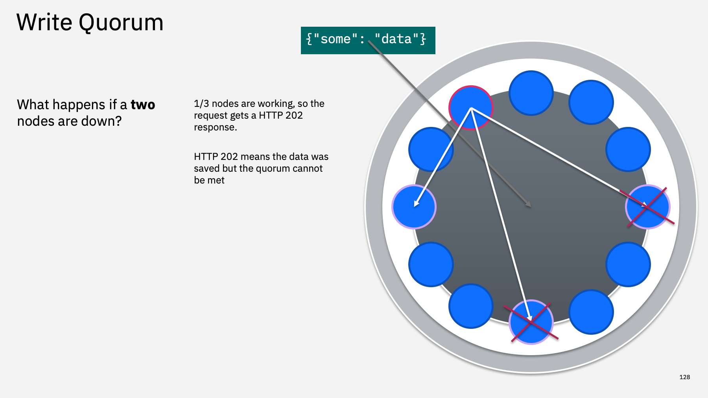

---

It's the same story for reads. Service continues with a failed node. We can survive one failed node...

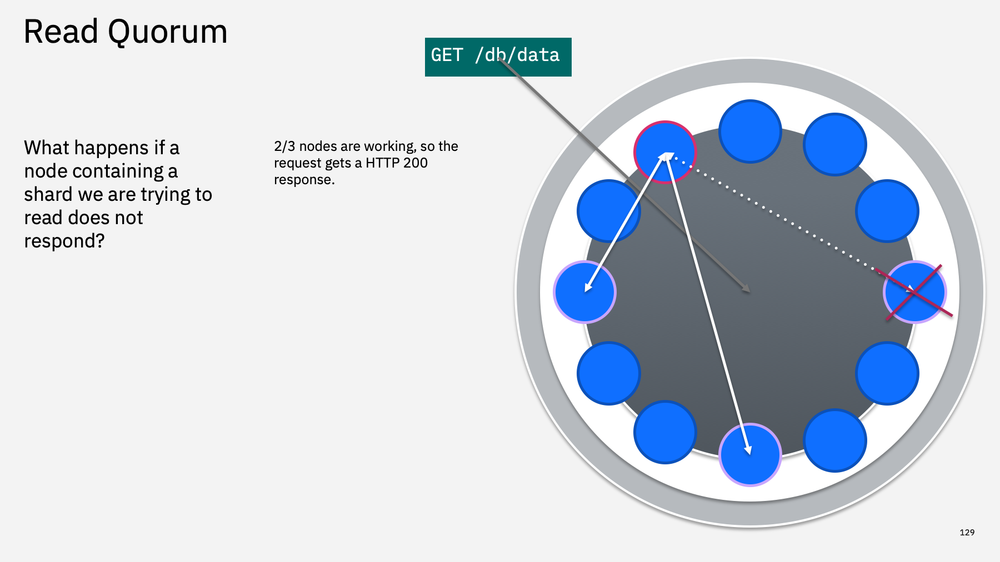

---

Or more failed nodes. As long as there is a copy of each node in existance, the API should continue to function.

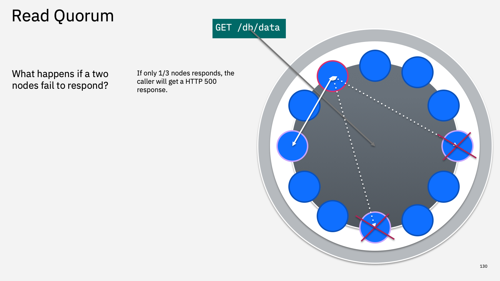

---

When a node returns, it will catch up any missed data from its peers and then return into service, handling API calls and answering queries for data.

---

The nature of this configuration where any node can handle a request and data is distributed around nodes without the sort of locking you would see in a relational database, is that Cloudant exhibits _eventual consistency_:

- Cloudant favours _availability_ over _consistency_: it would rather be up an answering API calls, than be down because it can't provide consistency guarantees. (a relational database is often configured in the opposite way: it operates in a consistent manner or not at all).
- The upshot of this as a developer is that your app should not "read its writes" in a short period of time - there may be a small time window in which it is possible to see an older version of a document than the one you just updated. _Eventually_ the data will flow around the cluster and in most cases, the quorum mechanism will provide the illusion of consistency, but it is best not to rely on it.

Note in CouchDB 4, and in Cloudant services based on that code version, a different consistency model will be employed.

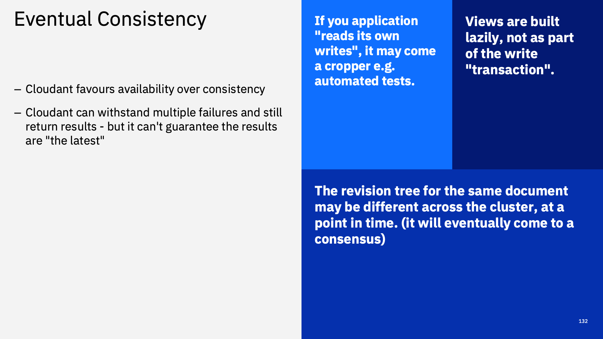

---

If your data model requires you to update a document over and over in a short time window, it's possible that multiple writes for the same revision number are accepted leading to a branch in the revision tree - known as a conflict. In this example revision "2" was modified in two diffent ways, causing 2 revision 3s. It's possible to tidy up conflicts programmatically, but they should be avoided as they can cause performance issues in extreme circumstances.

Conflicts can also happen when using replication and a document is modified in different ways and then the conflicting revisions are merged in via replication. Cloudant does not throw away data in this scenario - a "winning" revision is chosen, but the non-winning revisions can be accessed and your application can resolve the conflict by electing a new winner, deleting unwanted revisions or any action you need. A conflict is not an error condition, its a side effect of having disconnected copies of data that can be modified without locking - Cloudant chooses to handle this by not discarding clashing changes, but storing them as a conflict.

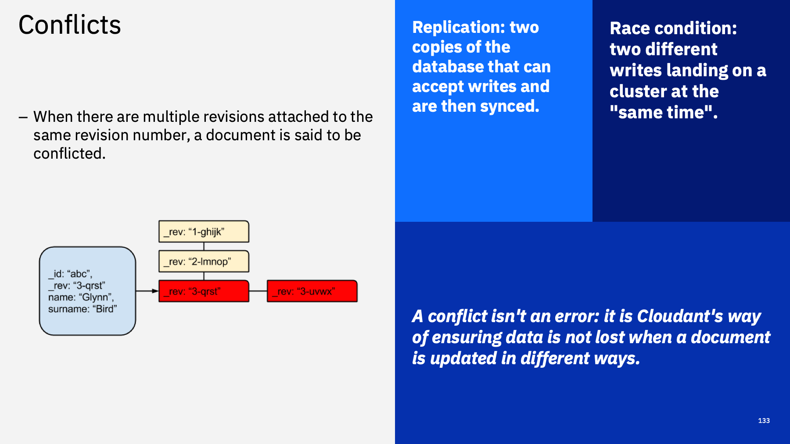

---

To check a document for conflicts, simply add `?conflicts=true` to a fetch of a single document. Any conflicting revisions will be listed in the `_conflicts` array.

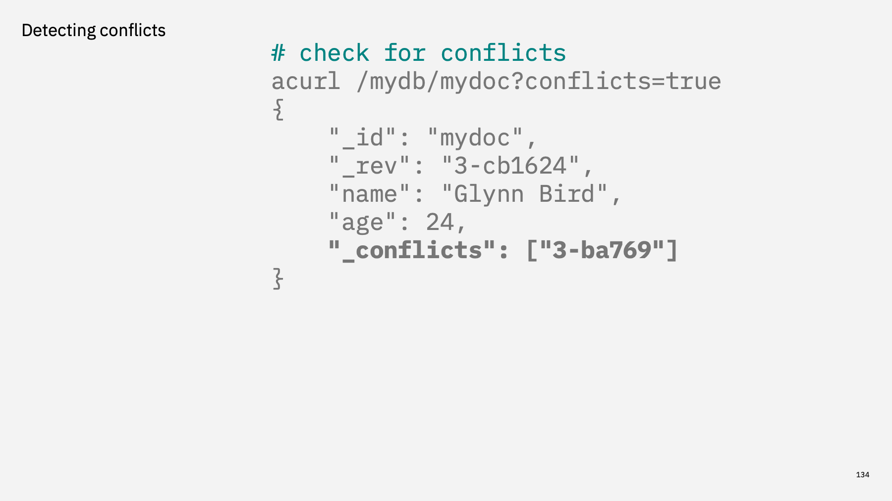

---

Unwanted revisions can be removed using the normal DELETE operation, specifying the rev token of the revision you wish to delete. The bulk API is also good for removing conflicting revisions, even for removing multiple conflicts from the same document.

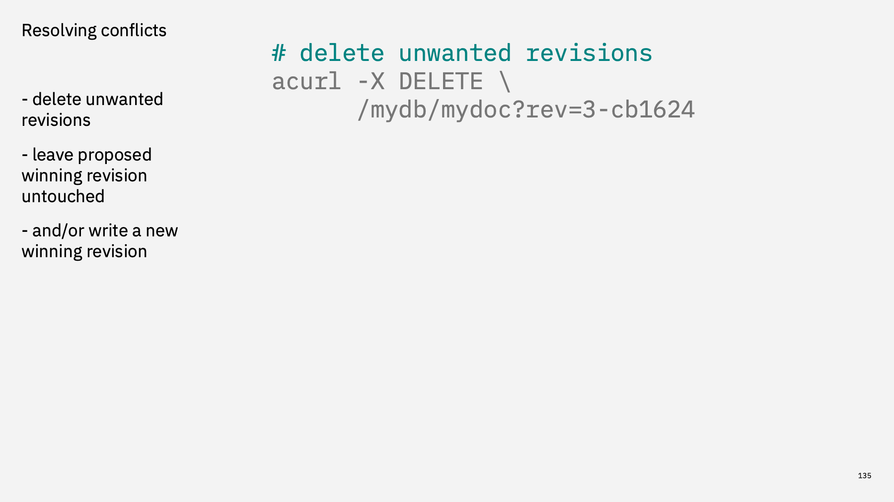

---
To summarise 

Cloudant is a distributed service which stores databases which broken into multiple shards, with three copies of each shard spread around a ring of storage nodes. Cloudant is eventually consistent, favouring high availability over strong consistency.

Avoid writing to the same document over and over so as not to create conflicts, although conflicts are sometime inevitable in replicating situations.

Embrace eventual consistency - don't try and _make_ Cloudant consistent. 

Note: Cloudant products based of CouchDB 4 may have a different consistency model. 

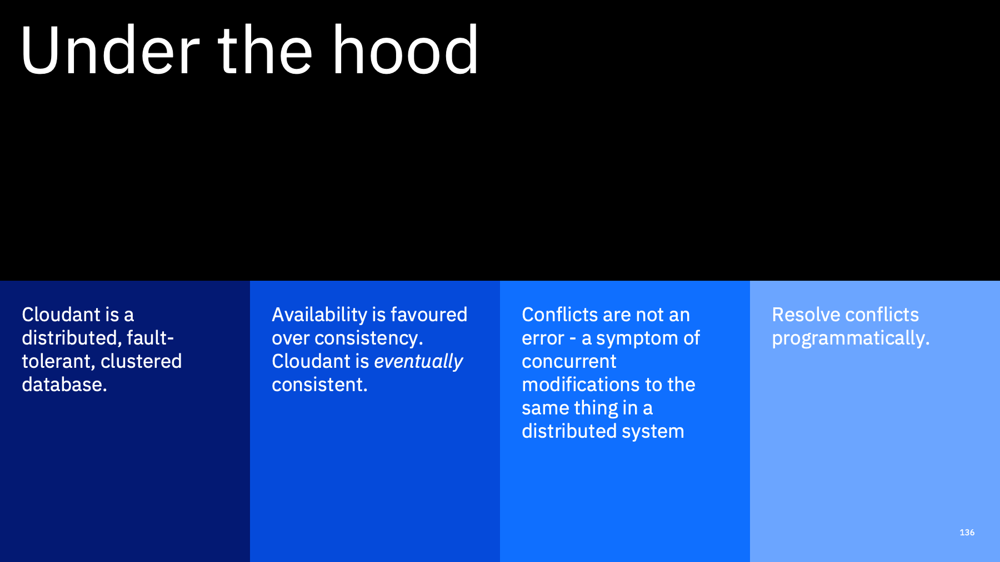

---

 

---

---